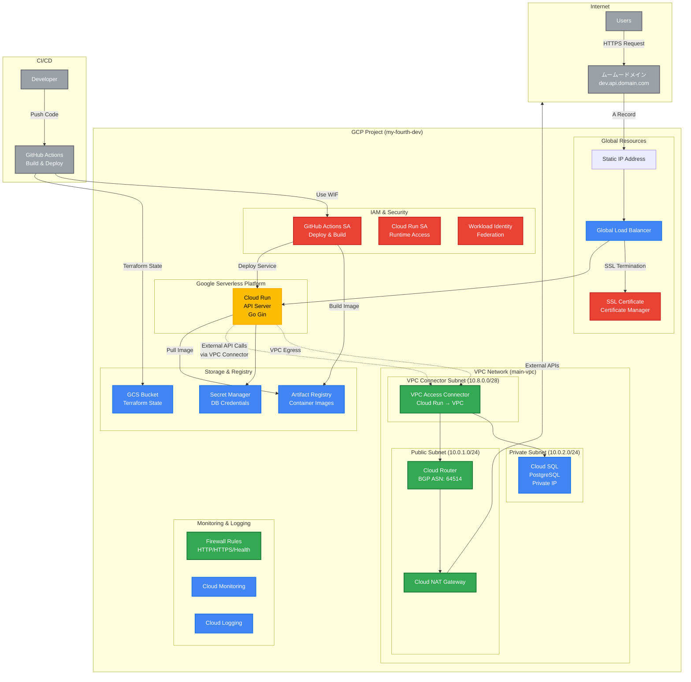

## terraformの構成について

- rakushite-inc.jp （google workspaseで作成をされた組織）
  - my-fourth-dev（dev環境）
  - my-fourth-prod （本番）
  - my-fourth-quota （請求の設定、別リポジトリ）

このリポジトリで操作をするのは、 my-fourth-dev と my-fourth-prod になります。

## 初期手順

1. owner権限を持つ開発者にグループへの招待を依頼してください。
2. 招待をしてもらうとgcpのコンソールにログインが可能になるはずです。
3. gcloud コマンドをinstallしてください。[ドキュメントはこちら](https://cloud.google.com/sdk/docs/install?hl=ja)

```bash
# 開発環境用の設定を作成
gcloud config configurations create [ex: my-fourth-dev-name]
gcloud config set account [groupに招待をしてもらったemail]
gcloud config set project my-fourth-dev

# 本番環境用の設定を作成（招待をされている場合）
gcloud config configurations create [ex: my-fourth-prod-name]
gcloud config set account [groupに招待をしてもらったemail]
gcloud config set project my-fourth-prod

# 登録をした特定の構成をアクティブにする。アクティブにした構成でgcloudでアクセスをされる
gcloud config configurations activate my-fourth-dev-katano
# ADCの仕組みで対象のアカウントでログインをする。
gcloud auth application-default login

```

現状のアクティブアカウントを確認

```bash
# 現在のプロジェクトID
gcloud config get-value project
```

```bash
# 現在の構成の一覧
gcloud config configurations list
```

## インフラ構成図



### アーキテクチャの特徴

**ネットワーク構成**

- Cloud RunはGoogleのサーバーレスプラットフォーム上で動作（VPCサブネット内ではない）
- VPC Access ConnectorでCloud RunからVPC内リソースへのアウトバウンド接続を実現
- VPCネットワーク内にパブリック・プライベートサブネットを分離
- Cloud Routerで外部接続を制御、Cloud NATで外部アクセスを実現

**セキュリティ**

- Cloud SQLをプライベートサブネット内に配置
- VPC Access ConnectorでCloud RunからCloud SQLへの安全な接続
- Workload Identity Federationで安全なCI/CD認証

**スケーラビリティ**

- Cloud Runによる自動スケーリング
- Global Load Balancerでの負荷分散
- Artifact Registryでのコンテナ管理
